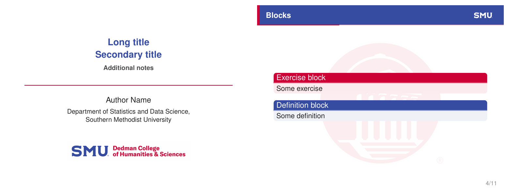

# SMU Statistics & Data Science — Beamer Template

An **unofficial** [Beamer](https://ctan.org/pkg/beamer) presentation template styled for the
**Department of Statistics and Data Science** at **Southern Methodist University (SMU)** —
ready to use on [Overleaf](https://www.overleaf.com) or any local LaTeX install.



## Features

- Clean SMU-branded look: navy header bar (`#354CA1`) with a crimson accent stripe (`#CC0035`)
- Faded Dallas Hall watermark, white **SMU** stamp on every slide, and the Dedman College
  wordmark on the title page
- Self-contained — built on **stock `beamer` + `tikz`**, no external theme to install
- Progress bar in the header that fills as you advance through the deck
- Helvetica text + Courier code, ready-made example slides (blocks, code, tables, equations)
- Chicago author-date references via **`biblatex-chicago`/`biber`** with placeholder entries to fill in

## How to use

### 1. Fork this repository

Click **Fork** (top-right of this page) so you have your own copy to edit. This keeps the
template intact and gives you a repo you can import and version.

### 2. Open it in Overleaf

Pick whichever fits your Overleaf plan:

**a) One-click (easiest, works on free accounts)** — opens a fresh Overleaf project from this template:

[](https://www.overleaf.com/docs?snip_uri=https://github.com/dukechain2333/smu-stats-beamer-template/archive/refs/heads/main.zip)

> Tip: after forking, swap `dukechain2333/smu-stats-beamer-template` in that link for
> `YOUR-USERNAME/smu-stats-beamer-template` to load your own fork.

**b) Import from GitHub (keeps the repo linked, Overleaf Premium)** —
in Overleaf go to **New Project → Import from GitHub**, authorize GitHub if prompted,
and select **your fork**. Changes can then be synced both ways.

**c) Download & upload (works on free accounts)** —
on your fork click **Code → Download ZIP**, then in Overleaf choose
**New Project → Upload Project** and drop the ZIP in.

Overleaf auto-detects `slide.tex` as the main document. Make sure the compiler is set to
**pdfLaTeX** (Menu → Compiler).

### 3. Edit and present

Open `slide.tex` and fill in your details:

```latex
\title{Long title \\ Secondary title}
\subtitle{Additional notes}
\author{Your Name}
\institute{Department of Statistics and Data Science,\\
           Southern Methodist University}
```

Then write your slides between `\begin{document}` and `\end{document}` using the included
examples as a guide.

## Slide structure (important)

This template's table of contents and **two progress bars** are driven by the
`section → subsection → frame` hierarchy. Getting that hierarchy wrong is the most common
cause of a broken TOC or a progress bar stuck at 0 % / 100 %. Follow these rules:

```latex
\section{Adding extras}      % 1. section first
\subsection{Table}           % 2. then a subsection
\begin{frame}{Table}         % 3. then the frame(s)
  ...
\end{frame}
```

- **Always nest `\section` → `\subsection` → `\begin{frame}`.** Put `\section` and
  `\subsection` on their own line *before* the frame they introduce — never inside a frame.
- **Every content frame must sit under a `\subsection`.** The header progress bar measures
  the current subsection's position within its section, so a frame with no subsection shows
  an **empty** bar.
- **A subsection may hold several frames.** The header bar just stays on that subsection's
  number across them — that's expected.
- **The `\subsection` name** feeds the TOC, the PDF bookmarks, and the progress-bar steps;
  the **frame title** `\begin{frame}{...}` is only the on-slide header. They can match or
  differ — you don't have to repeat the subsection name as the title.
- **Keep the title and table-of-contents frames above the first `\section`** so they stay
  out of the TOC and bookmarks.
- **Recompile twice after structural edits.** The TOC and progress bars are computed from
  `slide.aux` across runs, so after adding/removing/reordering any (sub)section run the build
  again (or just use `latexmk -pdf slide.tex`).

The same rules are repeated as a comment block inside `slide.tex`, just above the first
`\section`, for quick reference while editing.

## Building locally

```bash
pdflatex slide.tex
biber slide          # resolves the references
pdflatex slide.tex
pdflatex slide.tex   # final pass so refs + progress bar settle
```

(or simply `latexmk -pdf slide.tex`, which runs `biber` for you)

> On Overleaf this is automatic — just set the compiler to **pdfLaTeX**; Overleaf detects
> `biblatex` and runs `biber` on its own.

## Files

| File | Purpose |
|------|---------|
| `slide.tex` | Main document — theme definition + your content |
| `slide.bib` | Bibliography database (placeholder references — replace with your own) |
| `SMUbg.png` | Dallas Hall watermark (faded background) |
| `SMU-Dedman.jpg` | Dedman College wordmark (title page) |
| `SMUlogoWhite.png` | White SMU stamp (top-right of each slide) |
| `preview.png` | Rendered preview shown above |

The image assets are optional: the template uses `\IfFileExists` and falls back gracefully
(text logo, no watermark) if any are missing. Drop in your own institution's images to
re-skin it.

## License & trademarks

The template **code** is released under the [MIT License](LICENSE). The included SMU image
assets are official **Southern Methodist University** marks, remain SMU's property, and are
subject to [SMU's brand guidelines](https://www.smu.edu/brand). If you are not affiliated
with SMU, replace them with your own logos before use.

> This is a community template and is **not** officially endorsed by SMU.
