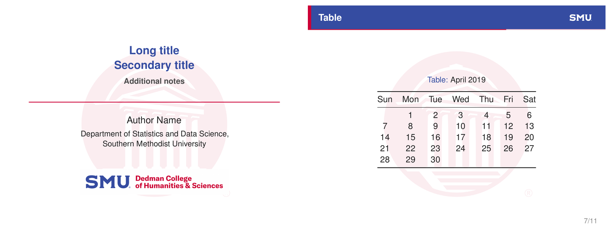

# SMU Statistics & Data Science — Beamer Template (Quarto)

An **unofficial** [Quarto](https://quarto.org) presentation template styled for the
**Department of Statistics and Data Science** at **Southern Methodist University (SMU)**.
You write slides in Markdown (`slide.qmd`), and Quarto renders them to a Beamer PDF with the
same look as the LaTeX template.

> **This is the `quarto` branch.** The original plain-LaTeX version (`slide.tex`, which also
> works on Overleaf) lives on the
> [`main`](https://github.com/dukechain2333/smu-stats-beamer-template/tree/main) branch.



## Features

- Clean SMU-branded look: navy header bar (`#354CA1`) with a crimson accent stripe (`#CC0035`)
- Faded Dallas Hall watermark, white **SMU** stamp on every slide, and the Dedman College
  wordmark on the title page
- Write slides in **Markdown**, and run **R / Python code** in them
- Progress bar in the header that fills as you advance through the deck, plus a
  "sections to go" bar on each section divider
- Helvetica text + Courier code, ready-made example slides (blocks, code, tables, equations)
- Chicago author-date references via **`biblatex-chicago`/`biber`**: cite with `@key` /
  `[@key]`

## Requirements

- [Quarto](https://quarto.org/docs/get-started/) 1.4 or newer
- A LaTeX distribution with `pdflatex`, `biber`, and `biblatex-chicago`. Any full
  TeX Live / MacTeX / MiKTeX install has these. If you use TinyTeX (`quarto install tinytex`),
  Quarto installs most missing packages for you on first render. You may need to add
  `biber` yourself with `tlmgr install biber biblatex-chicago`.
- *(optional)* R with the `knitr` + `rmarkdown` packages, or Python with Jupyter, only if
  you want code chunks to run

## How to use

### 1. Get a copy

**a) `quarto use template` (easiest).** This creates a new folder with `slide.qmd`, the
theme extension, `slide.bib`, and the logo images:

```bash
quarto use template dukechain2333/smu-stats-beamer-template@quarto
```

**b) Fork and check out this branch.** Click **Fork** on GitHub (untick "Copy the `main`
branch only"), clone your fork, then run `git checkout quarto`.

**c) Download ZIP.** Switch GitHub's branch selector to `quarto`, then choose
**Code → Download ZIP**.

> Overleaf can't run Quarto. If you want to edit on Overleaf, use the LaTeX template on
> the `main` branch.

### 2. Edit and render

Fill in the YAML header at the top of `slide.qmd`:

```yaml
---
title: |
  Long title\
  Secondary title
subtitle: Additional notes
author: Your Name
institute: |
  Department of Statistics and Data Science,\
  Southern Methodist University
bibliography: slide.bib
format: smu-beamer
---
```

(A trailing `\` forces a line break, as in `\\` in LaTeX.) Then write your slides below the
header and render:

```bash
quarto render slide.qmd
```

You can also press **Render** / **Preview** in RStudio, Positron, or VS Code with the Quarto
extension. The title slide and table of contents are generated for you from the YAML header.

## Slide structure (important)

The table of contents and **two progress bars** are driven by the
`section → subsection → slide` hierarchy, which maps to heading levels:

```markdown
# Adding extras        <!-- 1. section (gets a divider slide) -->

## Table               <!-- 2. then a subsection -->

### Table              <!-- 3. then the slide(s); this is the slide title -->

Slide content ...
```

- **Always nest `#` → `##` → `###`.** `#` is a section, `##` a subsection, and `###`
  starts a new slide.
- **Every slide must sit under a `##` subsection.** The header progress bar measures the
  current subsection's position within its section, so a slide with no subsection shows an
  **empty** bar.
- **A subsection may hold several `###` slides.** The header bar just stays on that
  subsection's number across them. That's expected.
- **The `##` name** feeds the TOC, the PDF bookmarks, and the progress-bar steps.
  **The `###` heading** is only the on-slide title. They can match or differ.
- **Don't write the title or TOC slides by hand.** They come from the YAML header (set
  `toc: false` under `format: smu-beamer:` to drop the TOC).

The same rules are repeated as a comment block inside `slide.qmd`, just below the YAML
header.

## Writing slides

| You want… | Write in `slide.qmd` |
|-----------|----------------------|
| Blue block | `#### Definition block` inside a slide |
| Crimson block | `#### Exercise block {.example}` |
| Code | a fenced ```` ``` ```` block (framed and line-numbered automatically) |
| Inline math / display math | `$x^2$` / `$$ ... $$` |
| Table with caption | a Markdown pipe table followed by `: Caption` |
| Citation | `@key` → Doe and Smith (2021); `[@key1; @key2]` → (Doe and Smith 2021; …) |
| Slide whose content may overflow | `### Title {.allowframebreaks}` |

Markdown tables render with booktabs-style horizontal rules. They don't have the full grid
of the LaTeX version. If you need the grid, put a raw LaTeX `tabular` in the slide.

### Running code

Turn a fenced block into a live chunk by adding braces around the language. Quarto hides
the source of executed code on slides by default, so turn `echo` on to show it:

````markdown
```{r}
#| echo: true
summary(cars$speed)
```
````

The source and its output each get the same framed, line-numbered look. A document with
`{r}` chunks needs R + `knitr`/`rmarkdown`. With `{python}` chunks it needs Python + Jupyter.

### References

Entries live in `slide.bib`. The reference list is printed wherever this div appears. In
the template it sits on the last slide:

```markdown
## Bibliography

### References {.allowframebreaks}

::: {#refs}
:::
```

If you delete the div, a **References** slide is added at the end automatically.
`nocite: "@*"` in the YAML header lists every entry in `slide.bib`, even uncited ones.
Remove it to list only what you cite.

## How it works

`format: smu-beamer` comes from the Quarto extension in `_extensions/smu/`:

| File | Purpose |
|------|---------|
| `_extension.yml` | Format defaults: `pdflatex`, 4:3, 11pt, `slide-level: 3`, TOC, biblatex, ≥ 2 LaTeX passes |
| `smu-theme.tex` | The theme itself (colours, header bar, title page, dividers, footer), the same as the preamble of `slide.tex` on `main` |
| `before-body.tex`, `toc.tex` | Title slide and table-of-contents slide |
| `biblio-config.tex`, `biblio.tex` | Load `biblatex-chicago` and place the fallback References slide |
| `smu.lua` | Turns `::: {#refs}` into `\printbibliography`, and drops HTML comments so they don't create blank slides |

Any option in `_extension.yml` can be overridden per document:

```yaml
format:
  smu-beamer:
    aspectratio: 169   # widescreen
    toc: false
    keep-tex: true     # keep slide.tex for debugging
```

The TOC and both progress bars are computed from the `.aux` file of the previous LaTeX
pass. The format always runs LaTeX at least twice, so they settle on their own.

## Files

| File | Purpose |
|------|---------|
| `slide.qmd` | Your slides (YAML header + Markdown content) |
| `_extensions/smu/` | The `smu-beamer` Quarto format (see above) |
| `slide.bib` | Bibliography database (placeholder references; replace with your own) |
| `SMUbg.png` | Dallas Hall watermark (faded background) |
| `SMU-Dedman.jpg` | Dedman College wordmark (title page) |
| `SMUlogoWhite.png` | White SMU stamp (top-right of each slide) |
| `slide.pdf`, `preview.png` | Rendered example deck and the preview shown above |

The image assets are optional. They are looked up next to `slide.qmd`, and the theme falls
back gracefully (text logo, no watermark) if any are missing. Drop in your own institution's
images to re-skin it.

## License & trademarks

The template **code** is released under the [MIT License](LICENSE). The included SMU image
assets are official **Southern Methodist University** marks, remain SMU's property, and are
subject to [SMU's brand guidelines](https://www.smu.edu/brand). If you are not affiliated
with SMU, replace them with your own logos before use.

> This is a community template and is **not** officially endorsed by SMU.
